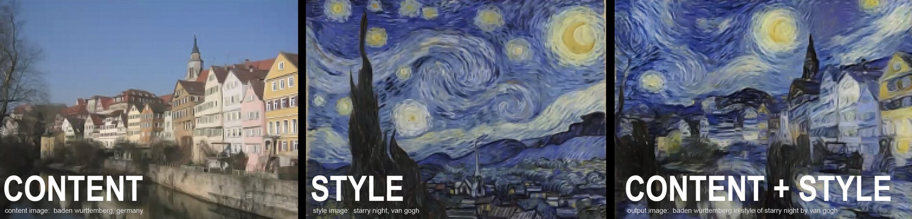

# Style transfer 

Style transfer uses the features found in the 19-layer VGG Network, which is comprised of a series of convolutional and pooling layers, and a few fully-connected layers.

Style transfer relies on separating the content and style of an image. Given one content image and one style image, we aim to create a new, target image that should contain our desired content and style components:
* objects and their arrangement are similar to that of the content image
* style, colors, and textures are similar to that of the style image

 * [ ] Requirements:
- python 
- PyTorch
- Nvidia GPU that supports Cuda 

 * [ ] to run :

 1.  open style_tranfer.py 
 2. specify the content image and style image locations 
 3.  run the model 

***Note:*** in order to run the model you need to use Cuda compatible device to train the model faster

## example of the results :

